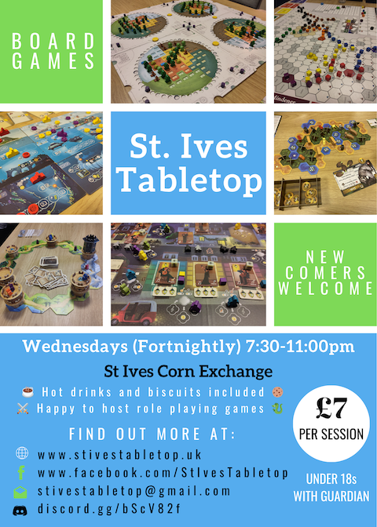

We are currently in the process of trying to start organising a fortnightly tabletop group for the area around St. Ives, Cambridgeshire.  I aim to cover tabletop RPGs (which I have a reasonable amount of experience running) and also playing board games (I have >100 myself, let alone some of my friends!).

Discord is the home to this group:  
<iframe src="https://discordapp.com/widget?id=590532081428201473&theme=dark" width="350" height="500" allowtransparency="true" frameborder="0"></iframe>

Alternatives are:  
Email: [stivestabletop@gmail.com](mailto:stivestabletop@gmail.com)  
Twitter: <a href="https://twitter.com/StIvesTabletop?ref_src=twsrc%5Etfw" class="twitter-follow-button" data-show-count="false">Follow @StIvesTabletop</a>
