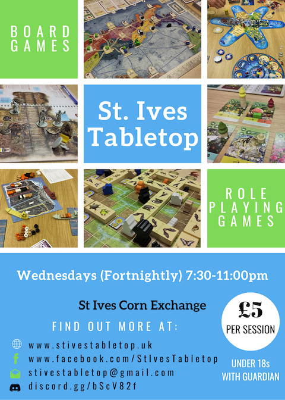

We are currently in the process of trying to start organising a fortnightly tabletop group for the area around St. Ives, Cambridgeshire.  I aim to cover tabletop RPGs (which I have a reasonable amount of experience running) and also playing board games (I have >100 myself, let alone some of my friends!).

